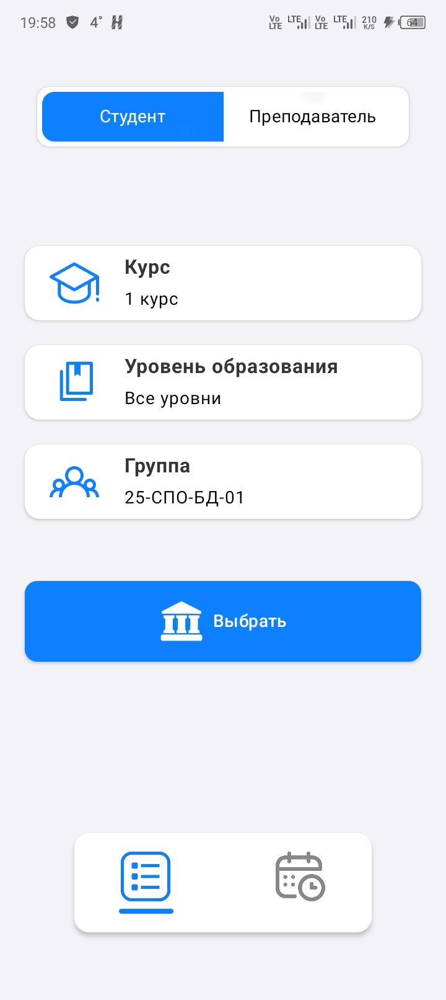
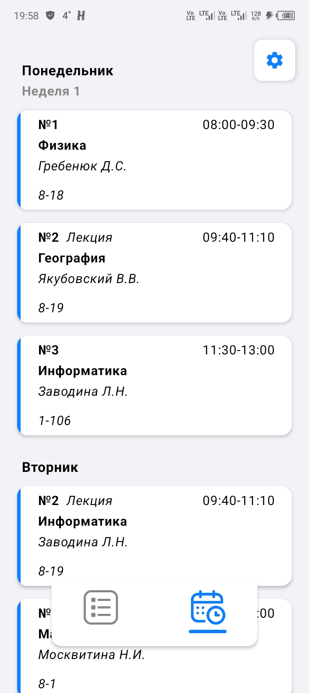
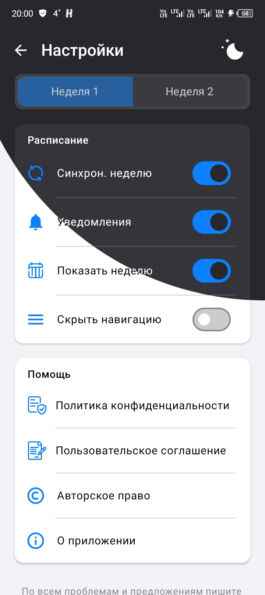
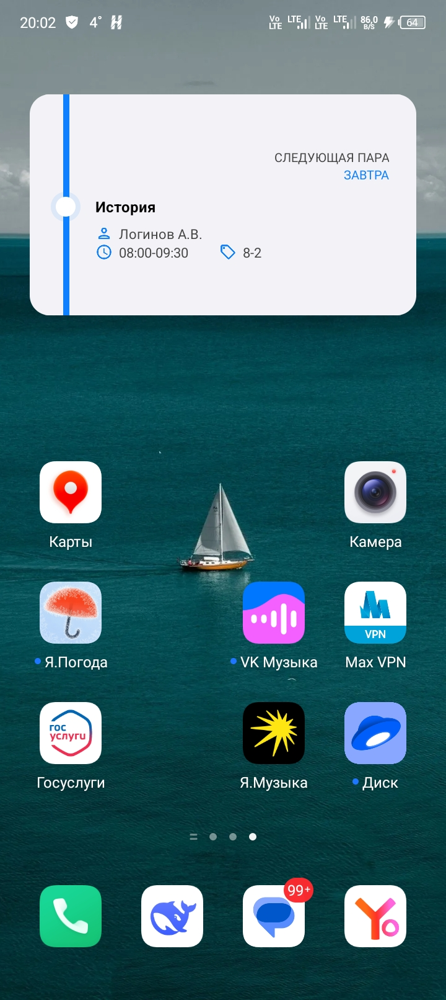

# Моя Академия — расписание для студентов и преподавателей

Моя Академия — это Android‑приложение для удобного просмотра учебного расписания. Приложение помогает студентам и преподавателям быстро получать актуальную информацию о занятиях без необходимости искать PDF‑файлы, таблицы или скриншоты расписания.
Основная цель проекта — предоставить простой и быстрый доступ к расписанию прямо со смартфона. Пользователь может выбрать свою учебную группу или использовать режим преподавателя, просматривать расписание на сегодня или на всю неделю, получать уведомления о начале занятий и удобно ориентироваться в учебном процессе.
Приложение создавалось как мобильный инструмент, который упрощает ежедневную работу с расписанием и делает взаимодействие с учебным процессом более удобным.

---

# Скриншоты

<p align="center" style>
  
  
  
  
</p>

---

# Основные возможности

## Выбор группы и фильтров

Пользователь может выбрать курс, уровень образования и свою учебную группу. После выбора данные сохраняются локально на устройстве, чтобы приложение автоматически открывало расписание при следующем запуске.

Доступны следующие функции:

- выбор курса и уровня образования (СПО, Бакалавриат, Магистратура и др.);
- поиск и выбор учебной группы;
- сохранение выбранной группы в локальном хранилище;
- автоматическое восстановление выбранной группы при следующем запуске приложения;
- режим преподавателя, который можно включить в настройках;
- офлайн режим работы;
- темная тема.

---

## Просмотр расписания

Приложение позволяет просматривать расписание занятий на текущий день или сразу на всю неделю.

Расписание отображается с разбивкой по дням недели и включает:

- название предмета
- аудиторию
- преподавателя
- время занятия

Если занятий в конкретный день нет, приложение показывает дружелюбное сообщение о выходном дне.

---

## Уведомления о занятиях

Приложение поддерживает систему локальных уведомлений, которые напоминают пользователю о предстоящих занятиях.

Пользователь может:

- включать или отключать уведомления;
- настраивать время напоминания перед началом занятия;
- получать уведомления только в режиме студента.

Такая система помогает не пропускать занятия и лучше планировать день.

---

## Виджеты расписания

Приложение может поддерживать виджеты для главного экрана Android.

Виджеты позволяют:

- быстро увидеть ближайшие занятия;
- открыть расписание прямо с домашнего экрана;
- получать актуальную информацию без запуска приложения.

---

## Настройки приложения

Экран настроек позволяет пользователю гибко настроить поведение приложения.

Доступны следующие параметры:

- отображение расписания только на сегодня или на всю неделю;
- управление выбранной учебной группой;
- переключение между режимом студента и преподавателя;
- включение или отключение уведомлений;
- настройка времени напоминаний;
- выбор темы интерфейса (светлая, тёмная или системная);
- раздел «О приложении».

---

# Технологический стек

Приложение разработано для платформы Android с использованием стандартных инструментов мобильной разработки.

Основные технологии проекта:

- Kotlin | 2.0.0
- Jetpack Compose |
- Room | 
- Hilt | 
- MyTracker |
- Tracer SDK |  
- RuStore SDK | 
- Gradle | 
- Minimum SDK | 21
- Target SDK | 34

Секретные ключи и токены:

- MyTracker - UX аналитика
- Tracer - Аналитика ошибок
- RuStore Remote Config - Удаленная конфигурация приложения
- Yandex Ads - Рекламная интеграция

```
tracer.pluginToken=YOUR_TOKEN
tracer.appToken=YOUR_TOKEN

remoteconfig.appId=YOUR_APP_ID
advertisement.bannerId=YOUR_BANNER_ID

mytracker.sdk.key=YOUR_KEY
```

Поля удаленного конфига: 

- `UserAgreement` - Пользовательское соглашение приложения с ссылкой на внешний сайт
- `PrivacyPolicy` - Политика конфиденциальности приложения с ссылкой на внешний сайт

- `ScheduleServiceAccessToken` - Токен доступа к серверу расписания

- `Advertisement` - Разрешение для приложения показывать рекламу на всех устройствах
- `ScheduleServer` - IP адрес сервера для просмотра расписания

---

# Архитектура приложения

Проект имеет стандартную структуру Android‑приложения. Код разделён по пакетам (feature-sliced), отвечающие за пользовательский интерфейс, бизнес‑логику и хранение данных.

Типичная структура проекта:

```
└── ./
    ├── app
    │   └── src
    │       ├── main
    │       │   └── java
    │       │       └── com
    │       │           └── mycollege
    │       │               └── schedule
    │       │                   ├── app
    │       │                   │   ├── activity
    │       │                   │   │   ├── data
    │       │                   │   │   │   ├── models
    │       │                   │   │   │   │   ├── Group.kt
    │       │                   │   │   │   │   ├── Schedule.kt
    │       │                   │   │   │   │   └── Teacher.kt
    │       │                   │   │   │   ├── network
    │       │                   │   │   │   │   └── WebParser.kt
    │       │                   │   │   │   └── repository
    │       │                   │   │   │       └── PersistenceRepository.kt
    │       │                   │   │   ├── domain
    │       │                   │   │   │   ├── models
    │       │                   │   │   │   │   └── LoadingState.kt
    │       │                   │   │   │   └── usecases
    │       │                   │   │   │       └── GetScheduleUseCase.kt
    │       │                   │   │   └── ui
    │       │                   │   │       ├── state
    │       │                   │   │       │   ├── AppEvent.kt
    │       │                   │   │       │   ├── AppState.kt
    │       │                   │   │       │   ├── MainViewModel.kt
    │       │                   │   │       │   └── StartViewModel.kt
    │       │                   │   │       ├── MainActivity.kt
    │       │                   │   │       └── StartScreen.kt
    │       │                   │   ├── navigation
    │       │                   │   │   ├── Destinations.kt
    │       │                   │   │   └── Routes.kt
    │       │                   │   ├── notifications
    │       │                   │   │   └── NotificationsManager.kt
    │       │                   │   ├── widgets
    │       │                   │   │   ├── ScheduleLargeWidgetReceiver.kt
    │       │                   │   │   └── ScheduleSmallWidgetReceiver.kt
    │       │                   │   ├── workmanager
    │       │                   │   │   ├── ScheduleSyncWorker.kt
    │       │                   │   │   ├── ScheduleWorker.kt
    │       │                   │   │   └── WeekChangeWorker.kt
    │       │                   │   └── App.kt
    │       │                   ├── core
    │       │                   │   ├── ads
    │       │                   │   │   └── YandexAdsListener.kt
    │       │                   │   ├── analitics
    │       │                   │   │   └── Tracker.kt
    │       │                   │   ├── cache
    │       │                   │   │   ├── CacheManager.kt
    │       │                   │   │   └── CacheUpdater.kt
    │       │                   │   ├── db
    │       │                   │   │   └── Database.kt
    │       │                   │   ├── di
    │       │                   │   │   ├── cache
    │       │                   │   │   │   └── CacheModule.kt
    │       │                   │   │   ├── db
    │       │                   │   │   │   └── DatabaseModule.kt
    │       │                   │   │   ├── resources
    │       │                   │   │   │   └── ContextModule.kt
    │       │                   │   │   └── widget
    │       │                   │   │       └── WidgetEntryPoint.kt
    │       │                   │   └── network
    │       │                   │       ├── api
    │       │                   │       │   ├── configs
    │       │                   │       │   │   └── ConfigsApi.kt
    │       │                   │       │   ├── groups
    │       │                   │       │   │   └── GroupsApi.kt
    │       │                   │       │   └── teachers
    │       │                   │       │       └── TeachersApi.kt
    │       │                   │       ├── dto
    │       │                   │       │   ├── configs
    │       │                   │       │   │   └── WeekParityConfig.kt
    │       │                   │       │   ├── groups
    │       │                   │       │   │   ├── Courses.kt
    │       │                   │       │   │   ├── Groups.kt
    │       │                   │       │   │   ├── Levels.kt
    │       │                   │       │   │   └── Schedule.kt
    │       │                   │       │   └── teachers
    │       │                   │       │       └── Teachers.kt
    │       │                   │       ├── remote
    │       │                   │       │   └── RemoteConfigListener.kt
    │       │                   │       └── Network.kt
    │       │                   ├── feature
    │       │                   │   ├── groups
    │       │                   │   │   ├── data
    │       │                   │   │   │   └── repository
    │       │                   │   │   │       ├── GroupRepository.kt
    │       │                   │   │   │       └── TeacherRepository.kt
    │       │                   │   │   ├── domain
    │       │                   │   │   │   └── usecases
    │       │                   │   │   │       ├── student
    │       │                   │   │   │       │   ├── GetCoursesUseCase.kt
    │       │                   │   │   │       │   ├── GetGroupScheduleUseCase.kt
    │       │                   │   │   │       │   ├── GetGroupsUseCase.kt
    │       │                   │   │   │       │   └── GetLevelUseCase.kt
    │       │                   │   │   │       └── teacher
    │       │                   │   │   │           ├── GetDepartmentsUseCase.kt
    │       │                   │   │   │           ├── GetTeacherScheduleUseCase.kt
    │       │                   │   │   │           └── GetTeachersUseCase.kt
    │       │                   │   │   └── ui
    │       │                   │   │       ├── components
    │       │                   │   │       │   ├── ActionButton.kt
    │       │                   │   │       │   ├── BottomSheet.kt
    │       │                   │   │       │   ├── CachedMark.kt
    │       │                   │   │       │   ├── GroupCard.kt
    │       │                   │   │       │   ├── ModeSegmentedButton.kt
    │       │                   │   │       │   └── SearchField.kt
    │       │                   │   │       ├── state
    │       │                   │   │       │   ├── GroupEvent.kt
    │       │                   │   │       │   ├── GroupState.kt
    │       │                   │   │       │   └── GroupViewModel.kt
    │       │                   │   │       └── GroupScreen.kt
    │       │                   │   ├── onboarding
    │       │                   │   │   └── ui
    │       │                   │   │       ├── state
    │       │                   │   │       │   └── OnboardingViewModel.kt
    │       │                   │   │       └── OnboardingScreen.kt
    │       │                   │   ├── schedule
    │       │                   │   │   ├── data
    │       │                   │   │   │   ├── models
    │       │                   │   │   │   │   └── DataClasses.kt
    │       │                   │   │   │   └── repository
    │       │                   │   │   │       └── ScheduleRepository.kt
    │       │                   │   │   ├── domain
    │       │                   │   │   │   └── usecase
    │       │                   │   │   │       ├── GetChosenGroupUseCase.kt
    │       │                   │   │   │       ├── GetGroupUseCase.kt
    │       │                   │   │   │       ├── GetTeacherUseCase.kt
    │       │                   │   │   │       ├── GetTodayScheduleUseCase.kt
    │       │                   │   │   │       └── GetWeekScheduleUseCase.kt
    │       │                   │   │   └── ui
    │       │                   │   │       ├── components
    │       │                   │   │       │   ├── schedule
    │       │                   │   │       │   │   ├── EmptySchedule.kt
    │       │                   │   │       │   │   ├── Schedule.kt
    │       │                   │   │       │   │   └── WeekendSchedule.kt
    │       │                   │   │       │   ├── settings
    │       │                   │   │       │   │   └── SettingsButton.kt
    │       │                   │   │       │   └── utils
    │       │                   │   │       │       ├── ImageLoader.kt
    │       │                   │   │       │       └── RenderEngines.kt
    │       │                   │   │       ├── state
    │       │                   │   │       │   ├── ScheduleEvent.kt
    │       │                   │   │       │   ├── ScheduleState.kt
    │       │                   │   │       │   └── ScheduleViewModel.kt
    │       │                   │   │       └── ScheduleScreen.kt
    │       │                   │   ├── settings
    │       │                   │   │   ├── domain
    │       │                   │   │   │   └── usecase
    │       │                   │   │   │       └── GetWeekParityUseCase.kt
    │       │                   │   │   └── ui
    │       │                   │   │       ├── components
    │       │                   │   │       │   ├── AboutBottomSheet.kt
    │       │                   │   │       │   ├── CardSettings.kt
    │       │                   │   │       │   ├── CircleThemeTransition.kt
    │       │                   │   │       │   ├── ContactLabel.kt
    │       │                   │   │       │   ├── CopyrightView.kt
    │       │                   │   │       │   ├── PdfViewerFromAssets.kt
    │       │                   │   │       │   ├── SegmentedButton.kt
    │       │                   │   │       │   ├── ThemeToggleButton.kt
    │       │                   │   │       │   └── WebView.kt
    │       │                   │   │       ├── state
    │       │                   │   │       │   ├── SettingsEvent.kt
    │       │                   │   │       │   ├── SettingsState.kt
    │       │                   │   │       │   └── SettingsViewModel.kt
    │       │                   │   │       └── SettingsScreen.kt
    │       │                   │   └── widgets
    │       │                   │       └── ui
    │       │                   │           ├── components
    │       │                   │           │   ├── CurrentLesson.kt
    │       │                   │           │   ├── GlanceProgressBar.kt
    │       │                   │           │   ├── NextLesson.kt
    │       │                   │           │   ├── ScheduleAlert.kt
    │       │                   │           │   ├── TomorrowLesson.kt
    │       │                   │           │   └── Weekend.kt
    │       │                   │           ├── ScheduleLargeWidget.kt
    │       │                   │           └── ScheduleSmallWidget.kt
    │       │                   └── shared
    │       │                       ├── resources
    │       │                       │   └── ResourceManager.kt
    │       │                       ├── ui
    │       │                       │   ├── components
    │       │                       │   │   ├── CustomAppBar.kt
    │       │                       │   │   └── ModeTransition.kt
    │       │                       │   └── theme
    │       │                       │       ├── Color.kt
    │       │                       │       ├── Theme.kt
    │       │                       │       └── Type.kt
    │       │                       └── utils
    │       │                           └── ResponsiveTextSize.kt
    │       └── tests
    │           └── ParsingTest.kt
    └── baselineprofile
        └── src
            └── main
                └── java
                    └── com
                        └── mycollege
                            └── baselineprofile
                                ├── BaselineProfileGenerator.kt
                                └── StartupBenchmarks.kt

```

---

# Запуск проекта

Чтобы запустить приложение локально, выполните следующие шаги:

1. Клонируйте репозиторий:

   git clone <repository-url>

2. Откройте проект в Android Studio.

3. Дождитесь загрузки зависимостей Gradle.

4. Выберите эмулятор или подключённое Android‑устройство.

5. Запустите приложение через Run или комбинацией клавиш Shift + F10.

После сборки приложение будет готово к тестированию.

---

# Возможные улучшения

В будущем приложение может быть расширено следующими возможностями:

- push‑уведомления о переносе занятий;
- синхронизация с календарём;
- поддержка нескольких учебных групп;
- интеграция с университетскими информационными системами;
- улучшенные виджеты для домашнего экрана.

---

# Автор

Dimitri Simonyan | work@dsimonyan.ru

